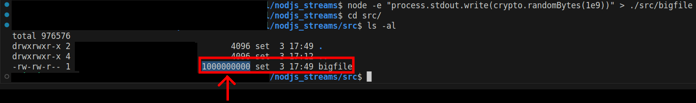
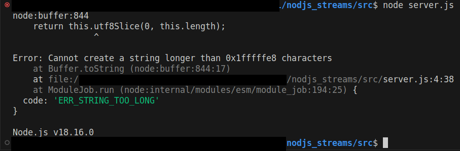
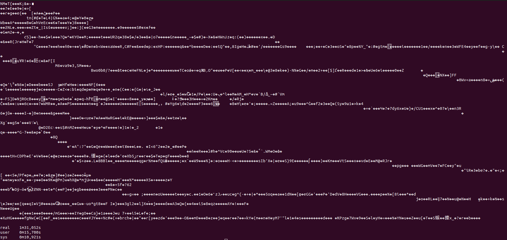

# Understanding Streams (simple example).

The goal of this code is for checking in a practical way how Streams works in NodeJS in a simple way.

If you don't know what are and the use case of Streams, I recomend to make a research first. Here, you will find only simple code.

The **Transform** will not be approached. Only **Read** and **Write**.

```
In simple words, Streams are used to consume Buffers of big files, big data from Database, 
big data from Requests, "breaking" in a small pieces called of chunks. Not all at once, 
but step by step.
```


## 1 - The wrong way.
Let's try to read a file with almost 1Gb inside memory and see whats happens

Type the command below, that generates file with almost 1Gb.

```
node -e "process.stdout.write(crypto.randomBytes(1e9))" > ./src/bigfile
```


 
After that, it will generate a file with almost 1Gb in **src** directory.
If you wanna check what is inside file I recommend to use **VIM**, but I can tell you that is only trash.

**Check and go to directory of the simple code inside ./src/server.js and run with:**

```     
node server.js
```

Now, let's read it at once and check the resuls:



## 2 - The right way.
Now let's read using Stream in the right way.

**Check and go to directory of the simple code inside ./src/server2.js and run with:**

**I recommend to use a LIGHTWEIGHT TERMINAL, otherwise the process will take so long.**

```     
node server2.js
```

Now, let's read it at once and check the resuls:



## Authors

- [@lcoutojunior](https://www.github.com/lcoutojunior) Luiz Meirelles